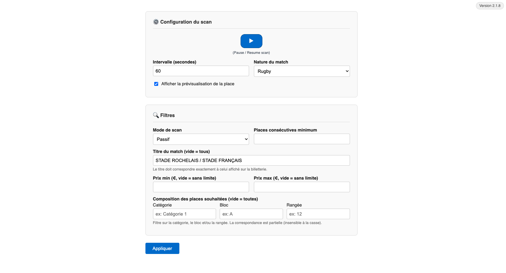

## How to access the admin panel

Depending on how you have set up the project (see [SERVER_INSTALLATION.md](SERVER_INSTALLATION.md) documentation), you can access the admin panel by going to `http://localhost:3000` in your web browser.

## How it looks

### Upper part: Main controls

- **Start/Stop**: Start or stop the bot. When the bot is stopped, it does not scan for tickets or send notifications.
- **Interval**: Set the scanning interval in seconds. This determines how often the bot checks for new tickets.
- **Nature**: Choose which type of filters to apply. This can be "Rugby" or "Basketball", depending on the matches you are interested in.
- **Preview**: A checkbox that enables the bot to send a preview of the ticket's seat details in the Telegram notification. This is useful for quickly assessing the ticket's quality without opening the link.

### Lower part: Filters management

- **Mode**: Choose the filter mode. "Passive" mode only sends notifications for tickets that match the filters, while "Aggressive" mode also adds tickets to the cart if you have provided your credentials in the `.env` file.
- **Consecutive seat**: Specify whether you want side-by-side tickets. You can set it to 2 if you want to go with a friend, but more than 2 is not recommended, since it is rare to find more than two consecutive tickets.
- **Price range**: Set the minimum and maximum prices for the tickets you want to be notified about. This helps you avoid tickets that are too expensive or too cheap.
- **Seat composition**: Choose whether there is a specific category, a specific sector, or a specific seat row you want to be notified about. This is useful if you prefer a certain area of the stadium.